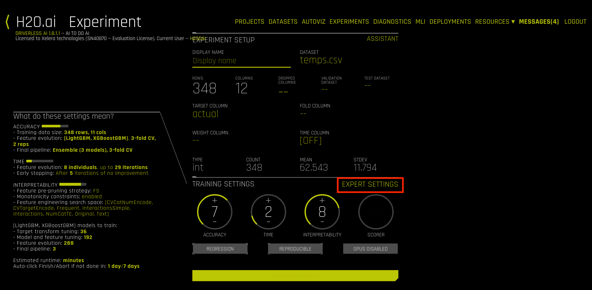
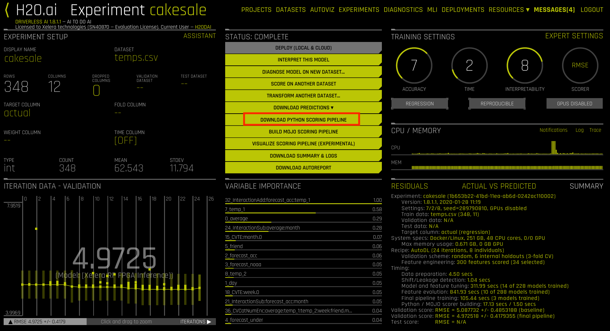

# Xelera Random Forest inference engine

<p align="center">

</p>

Xelera Random Forest inference engine provides FPGA-enabled real-time deployment for Classification and Regression tasks. It is fully integrated into [scikit](https://scikit-learn.org/stable/index.html) and [H2O driverless AI](https://www.h2o.ai/products/h2o-driverless-ai/).


## Supported Acceleration Platforms

|            Board            |           Driver          |     Shell        |  Note        |
| :-------------------------: |:-------------------------: |:-------------------------: |:-------------------------: |
|   [Xilinx Alveo U50](https://www.xilinx.com/products/boards-and-kits/alveo/u50.html)  | xrt_201920.2.3.1301 | xilinx-u50-xdma-201920.1  | available upon request |
|   [Xilinx Alveo U200](https://www.xilinx.com/products/boards-and-kits/alveo/u200.html) | xrt_201920.2.3.1301 | xilinx-u200-xdma-201830.2 | available upon request |
|   [Xilinx Alveo U250](https://www.xilinx.com/products/boards-and-kits/alveo/u250.html) | xrt_201920.2.3.1301 | xilinx-u250-xdma-201830.2 | provided with the docker image |

## Deployment modes

- **standalone**: end-to-end performance benchmarks on different problem sizes with python and Scikit
- **H2O DriverlessAI tuning:** algorithm and pipeline tuning with Xelera Random Forest BYOR model
- **H2O DriverlessAI deployment:** standalone scoring pipeline (Python) for production with Xelera Random Forest BYOR model

The instructions for each run configuration are given below.
s
#### Base Instructions

1. Contact Xelera at <info@xelera.io> and request access to Xelera Random Forest inference engine docker image
2. Load (``docker load < Xl_rf_inference.tar.gz``) the provided compressed docker image
3. Place your H2O DriverlessAI license file in ```license/license.sig``` (it is not needed for the deployment without H2O DriverlessAI. You can get an evaluation version [here](https://www.h2o.ai/try-driverless-ai/))
4. Start the container using the provided run script: ```./run_docker.sh```. Note that this forwards TCP port 12345 from the docker container to the host machine. This port is required by DriverlessAI.
5. For each sudo command inside the container, use ```dai``` as password

#### Run Standalone
1. Start the provided docker container. You will be logged in as user ```dai``` in the ```/app``` directory.
2. Execute ```sudo bash run_standalone_benchmark.sh```
3. It will take some time, since the Random Forest models with large tree amounts have to be trained first.
4. The inference results will be put into the file ```results.txt```
5. The trained models will also be exported in ``.pkl`` format. They can be reloaded for inference only tests. Make the following changes to `run_Xl_benchmark_single.py` to enable only inference:
    - `enable_training_CPU = False`
    - `enable_inference_CPU = True`
    - `enable_inference_FPGA = True`   

#### Run H2O DriverlessAI tuning
1. Inside the container, execute ```sudo bash init_h2o.sh```. This starts the H2O DriverlessAI backend
2. In the local browser, navigate to ```server:12345``` using the address bar. ```server``` is the name or IP address of the host machine running the docker container.
3. Log in using user: ```h2oai```, password: ```h2oai```
4. Go to the 'DATASETS' tab and select 'upload dataset'. Choose the file ```/app/temps.csv``` from the docker filesystem. This file is a dataset of temperature data publicly available at [File](https://drive.google.com/file/d/1pko9oRmCllAxipZoa3aoztGZfPAD2iwj/view). More information regarding this file can be found at
[towardsdatascience](https://towardsdatascience.com/random-forest-in-python-24d0893d51c0) in a guided example to Random Forest Predictors.
5. Go to the 'EXPERIMENTS' tab and select ```new experiment```
6. Select the ```temps.csv``` data set. In the opening dialogue, select ```actual``` as target column. If desired, give the experiment a name.



7. In the bottom right corner, select ```EXPERT SETTINGS```

8. Use the ```UPLOAD CUSTOM RECIPE``` button to select the delivered recipe ```xelera_byor.py``` from the local filesystem. You will see acceptance tests running.
9. In the 'RECIPES' tab, select values for 'include specific models'. Only select the ```XELERA RF FPGA INFERENCE```


10. In the 'SYSTEM' tab, set the following: 'Number of cores to use = 1' and 'Maximum number of cores to use for model predict = 1". This prohibits multiple processes from accessing the FPGA.

11. Leave the expert settings and launch the experiment.
12. You can see the progress in the central status bar. Wait until finished.

13. Detailed timing information can be found inside the docker in the DriverlessAI log file: ```/opt/h2oai/dai/log/dai.log```.
14. After the experiment has finished, you can download the python scoring pipeline for the deployment using the 'DOWNLOAD PYTHON SCORING PIPELINE' button. The resulting deployment pipeline will be download to the browser local file system.



#### Run H2O DriverlessAI deployment
Reference: [Driverless AI Documentation on Python Scoring Pipeline](http://docs.h2o.ai/driverless-ai/latest-stable/docs/userguide/scoring-standalone-python.html#running-the-python-scoring-pipeline-alternative-method)
1. As a requirement for this run, you must have completed the H2O DriverlessAI tuning and downloaded the 'Python Scoring Pipeline'
2. Extract the downloaded .zip file from the previous step into the directory of the docker container. If not named ```scoring-pipeline```, rename the directory to that name. This is required to mount the directory correctly. Copy the ```scoring-pipeline``` directory into the base directory of the docker container.
3. Inside the container (/app directory), navigate to the scoring-pipeline directory using ```cd scoring-pipeline```
4. Run the deployment pipeline example (provided by H2O) using ```sudo ./run_example.sh```
5. The script will install multiple dependencies in a virtual environment. Compare the )
6. In the end, the script will run the python scoring pipeline. You can see the printed messages from the custom recipe, indicating the runtimes and problem sizes. The amount of trees is determined by the DriverlessAI training; the amount of samples is coded in the example script.


## Standalone Benchmark results

#### Hardware Setup

- Server Dell PowerEdge R740
    - CPU: Intel(R) Xeon(R) Gold 5118 (32 cores) @ 2.30GHz
    - RAM: 256GB DDR4 @ 2666 MHz
- Accelerator platform:
    - Xilinx Alveo U250

#### Problem Setup
- Training:
    - CPU (Scikit)
- Inference:
    - FPGA (Xelera)
    - CPU (Scikit)
- Dataset: weather -> predict the temperature
    - Features: 16 numerical features
    - Trees: 8 levels max
    - Label: 54 classes
- Forest size: 100, 1000, 10000, 100000 trees
- Samples batch size: 1, 10, 100, 1000, 10000, 100000 samples

#### Goal
Measure RF inference Classifier end-to-end (python application) latency

#### Results

*CPU-based: Intel Xeon 5118 (32 cores) end-to-end latency [s]*

| Sample batch size \ Number of trees |  100 | 1000 | 10000 | 100000|
| :---------------------------------: | :--: | :--: | :---: | :---: |
|**1**      | 0.113754 | 0.558969 | 5.682151 | 60.4001916
|**10**     | 0.112719 | 0.615108 | 5.674495 | 65.8061304
|**100**    | 0.113577 | 0.717954 | 6.465377 | 65.3164281
|**1000**   | 0.110944 | 0.818687 | 7.682359 | 77.2385877
|**10000**  | 0.215964 | 1.42355 | 13.90265 | 136.317463
|**100000** | 1.354374 | 11.20106 | 112.6743 | 1129.38227


*FPGA-based: Xilinx Alveo U250 end-to-end latency [s]*

| Sample batch size \ Number of trees |  100 | 1000 | 10000 | 100000|
| :---------------------------------: | :--: | :--: | :---: | :---: |
|**1**      | 0.000523 | 0.000575 | 0.001169 | 0.003734 |
|**10**     | 0.000615 | 0.000583 | 0.001381 | 0.004252 |
|**100**    | 0.000980 | 0.000947 | 0.002377 | 0.010962 |
|**1000**   | 0.004594 | 0.004657 | 0.011452 | 0.055461 |
|**10000**  | 0.040474 | 0.040394 | 0.090505 | 0.424453 |
|**100000** | 0.332680 | 0.332680 | 0.805108 | 4.161537 |
